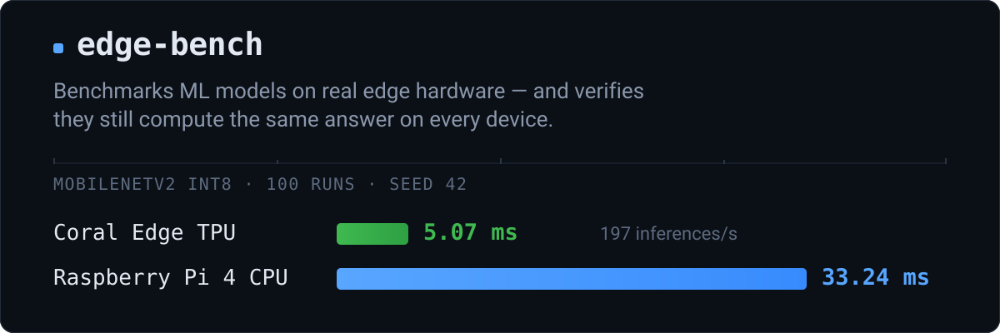

<p align="center">
  
</p>

You run a server on a workstation; lightweight agents run on the edge devices.
The server queues experiments, dispatches them to a device, collects latency,
throughput, memory and thermal metrics, and stores everything in SQLite with a
web dashboard on top.

---

## Measured, on real hardware

One model, three platforms, identical seeded input. `agent/benchmark_full.py`,
100 runs after 10 warmup, `governor=performance`.

| Platform | Runtime | Backend | p50 | p95 | Throughput | Peak RAM |
|---|---|---|---:|---:|---:|---:|
| Raspberry Pi 4 + Coral USB | tflite_runtime 2.14 | **Edge TPU** | **5.07 ms** | 5.12 ms | 197.0 /s | 47.8 MB |
| Raspberry Pi 4 | tflite_runtime 2.14 | CPU | 33.24 ms | 34.41 ms | 29.9 /s | 47.6 MB |
| Workstation x86_64 | ai-edge-litert 2.1.6 | CPU | 0.99 ms | 1.22 ms | 1011 /s | 61.8 MB |

Coefficient of variation on the Edge TPU run: **0.48 %**, 3 outliers in 100.
Source: [`results/2026-08-14_c6_edgetpu/`](results/2026-08-14_c6_edgetpu/).

## Speed is not the whole measurement

A benchmark that only times `invoke()` will happily report excellent latency for
a model that computes nonsense. edge-bench reads the output tensor too and
records a compact signature — top-k indices plus a dequantised checksum — so two
devices can be compared on **what they computed**, not just how fast.

That check found a real defect in this project's own corpus: a model carrying an
`int8` name that ran in float32, returned a different result on every fresh
interpreter, and tracked its fp32 reference at cosine **0.50**. Its latency had
been sitting in the results index for two months.

```bash
make check-determinism          # every model in data/models
```

```text
model                                    fresh  repeat  float/total  verdict
c6_mobilenet_v2_int8.tflite               1/8     1/8         0/175  deterministic
mobilenetv1_int8_ptq_Fuzzy.tflite         1/8     1/8          0/87  deterministic
```

`fresh` counts distinct outputs across freshly built interpreters — 1 is good.
`float/total` exposes a model labelled `int8` that is not doing integer inference.

---

## Contents

[Quick start](#quick-start) · [Configuration](#configuration) ·
[Running benchmarks](#running-benchmarks) · [Web interface](#web-interface) ·
[Results](#results) · [Tests](#tests) · [Docker](#docker) ·
[CI](#ci-and-quality-checks) · [Development](#development) ·
[Troubleshooting](#troubleshooting) · [Known limitations](#known-limitations)

## Quick start

```bash
git clone <repository-url>
cd edge-bench

make install          # poetry install --with dev + create data dirs
make run              # http://localhost:8000
```

`make help` lists every target. Nothing in the default test suite or CI needs a
Pi, a Coral, a GPU, a dataset or model weights.

**Requirements.** Server: Python 3.11–3.13 and [Poetry](https://python-poetry.org/) 2.x,
or just Docker. Agent: Raspberry Pi 4+ on 64-bit Raspberry Pi OS, Python 3.9+, a
TFLite runtime (the installer handles it), optionally a Coral USB Accelerator
with `libedgetpu1-std`.

### Put an agent on a Raspberry Pi

```bash
curl -sSL http://<SERVER_IP>:8000/install | bash
```

This downloads the agent, creates a venv, installs a systemd unit, starts it and
registers the device. `…/uninstall` reverses it. From a checkout the equivalent
is `make agent-deploy RPI_HOST=pi@192.168.1.100`.

```bash
curl -X POST http://localhost:8000/api/devices \
  -H "Content-Type: application/json" \
  -d '{"name": "rpi4-lab", "ip": "192.168.1.100", "port": 8001}'
```

## Configuration

Environment variables prefixed with `EDGEBENCH_`, all with working defaults —
the app starts with no configuration at all. `cp .env.example .env` to begin;
that file is the annotated reference.

| Variable | Default | Purpose |
|---|---|---|
| `EDGEBENCH_HOST` / `EDGEBENCH_PORT` | `0.0.0.0` / `8000` | Bind address |
| `EDGEBENCH_DATABASE_PATH` | `data/edgebench.db` | SQLite file |
| `EDGEBENCH_MODELS_DIR` | `data/models` | Uploaded models |
| `EDGEBENCH_AGENT_SECRET` | *(empty)* | Shared secret for `/api/*`; empty disables auth |
| `EDGEBENCH_PROXY_TRUST` | `127.0.0.1` | Which host may set `X-Forwarded-*` |
| `EDGEBENCH_INPUT_SEED` | `42` | Seed for synthetic benchmark input |
| `EDGEBENCH_DEBUG` | `false` | Enables the agent's `/execute/code` — never in production |

Relative paths resolve against the working directory: the repo root locally,
`/app` in the container. Set the same `EDGEBENCH_AGENT_SECRET` on the server and
every agent, or on neither.

## Running benchmarks

**From the dashboard.** Devices → register a Pi → Models → upload a `.tflite` →
**+ New** → pick model, backend, thread count, iteration counts → watch it on
Experiments → read Results.

**From the API.**

```bash
curl -X POST http://localhost:8000/api/experiments \
  -H "Content-Type: application/json" \
  -d '{"name": "mobilenet-v2 int8 on TPU", "device_id": "dev_abc123",
       "model_path": "/home/pi/models/mobilenetv2_int8_edgetpu.tflite",
       "params": {"backend": "edgetpu", "num_threads": 4,
                  "warmup_runs": 10, "benchmark_runs": 100}}'
```

**Directly on a device**, which is what produces citable numbers:

```bash
python3 agent/benchmark_full.py --model ~/models/model.tflite \
    --backend edgetpu --runs 100 --seed 42
```

**A quick pipeline check** — model loading, device detection, inference, timing,
memory, serialization — in a few seconds:

```bash
make install-hardware        # installs the right TFLite runtime for this host
make benchmark-smoke
```

Smoke output lands in `results/smoke/` and is validation evidence, not a
measurement: the iteration count is far too low to cite.

### Comparing devices and backends

```bash
make platform-matrix \
    MATRIX_MODEL=data/models/mobilenetv1_int8_ptq_Fuzzy.tflite \
    MATRIX_TARGETS="x86=:cpu rpi-cpu=rpi:cpu rpi-tpu=rpi:edgetpu@~/models/mobilenetv1_int8_ptq_Fuzzy_edgetpu.tflite"
```

Targets are `name=host:backend[@model]`; an empty host means this machine, and
`@model` is required for Edge TPU because it needs its own compiled build.
Remote targets need SSH and a TFLite runtime — the agent sources are copied to a
temporary directory and removed afterwards.

Besides latency per platform, the run compares output signatures and **exits
non-zero when a backend disagrees on top-1**, so it can gate a release.

### Methodology

- Warmup iterations are excluded from statistics.
- Garbage collection is disabled around the timed `invoke()` only, then
  restored, so it distorts neither latency nor memory.
- Input is generated from a fixed seed: quantized kernels can take different
  code paths depending on input distribution.
- `fps_from_mean` and `fps_from_median` are both reported; `fps` aliases the mean
  for backward compatibility.
- For publishable numbers, set the CPU governor to `performance` first. Under
  `powersave`, idle frequency scaling is indistinguishable from thermal
  throttling and the run gets flagged.

## Web interface

Server-rendered Jinja2 with a plain-CSS design system — no frontend build step,
no framework. Chart.js is vendored under `server/static/js/vendor/`, so the
dashboard works on an isolated lab network. Light and dark themes, Russian and
English.

| Page | For |
|---|---|
| `/` | Device and experiment counts, average and best latency |
| `/devices` `/models` | Register devices, upload models, convert for Edge TPU |
| `/experiments` `/experiments/{id}` | Queue, live status, percentiles, logs, warnings |
| `/results` `/compare` | Measured runs with comparative bars; side-by-side charts |
| `/benchmark` `/scripts` `/schedules` | Batch tools, remote execution, cron-style runs |
| `/settings` · `/docs` `/redoc` | Paths, timeouts, integrations · OpenAPI |

## Results

Results live in `results/`. Read [`results/README.md`](results/README.md) before
touching anything there — measured runs are research artifacts and are tracked in
git; `results/smoke/` is throwaway and is not.

Every result records what is needed to reproduce it: model name, sha256 prefix,
size, quantization, input shape and dtype; backend, thread count, warmup and
measured counts, input seed; full latency percentiles; both throughput
definitions; cold-start timings; CPU percent, process RSS, temperature and
frequency series; device and runtime provenance (`tflite_source`,
`tflite_version`, `numpy_version`, `python_version`, `cpu_governor`); the output
signature; and thermal or frequency warnings.

```bash
curl -o results.csv  http://localhost:8000/api/results/export/csv
curl -o results.json http://localhost:8000/api/results/export/json
```

## Tests

```bash
make test            # CPU-only suite, no hardware needed
make test-cov        # with coverage
make test-hardware   # pytest -m hardware
```

Hardware tests are excluded by default and skip cleanly when the runtime or a
model is missing — they are never satisfied by a mocked device. Override the
model with `EDGEBENCH_TEST_MODEL=/path/to/model.tflite`.

## Docker

```bash
make docker-up          # build + start via compose
make docker-logs
make docker-down
```

Multi-stage build with dependencies from `poetry.lock`, so the image is
reproducible. Runs as a non-root user; compose builds with `APP_UID`/`APP_GID`
matching the host so the bind-mounted `./data` stays writable. `HEALTHCHECK`
polls `/api/health`. Dev tooling never reaches the runtime image. uvicorn handles
`SIGTERM` and drains connections. The port is configurable:
`EDGEBENCH_PORT=18200 docker compose up -d`.

An optional benchmark image exists for hosts without a usable Python:

```bash
docker build --target bench -t edge-bench:bench .
docker run --rm -v "$PWD/data:/app/data:ro" -v "$PWD/results:/app/results" \
    edge-bench:bench --runs 30
```

`make docker-smoke` builds, runs, verifies and cleans up; `make docker-config`
validates the compose file.

## CI and quality checks

Everything CI runs is a Make target, so the pipeline is provider-agnostic and
reproducible locally:

```bash
make lint · make format-check · make typecheck · make test-cov · make build
make ci     # all of the above
```

`make ci` is CPU-only: no GPU, no Edge TPU, no model weights, no dataset. If it
passes locally it passes in CI. Hardware validation is a separate, opt-in level.
See [`docs/CI_READINESS.md`](docs/CI_READINESS.md) and
[`.github/workflows/ci.yml`](.github/workflows/ci.yml).

## Development

```bash
make dev        # uvicorn with autoreload on 127.0.0.1:8000
make format     # apply ruff fixes + formatting
make check      # fast gate: lint + tests
```

```text
server/    FastAPI app: api/ core/ db/ routes/ templates/ static/
agent/     deployed flat onto the Pi: executor, metrics, tflite_backend, benchmark_*
scripts/   host-side utilities: smoke, platform matrix, determinism, model export
tests/     pytest suite, hardware tests marked separately
docs/      CI_READINESS.md
results/   benchmark output — see results/README.md
```

Conventions worth knowing:

- Ruff is the single source of truth for lint and formatting; config in
  `pyproject.toml`. Single quotes, 88 columns.
- `agent/benchmark_*.py` are the canonical benchmark implementations. Divergent
  copies are how two "identical" runs end up producing different numbers.
- `agent/` is deployed flat on the Pi and uses top-level imports
  (`from metrics import ...`), so it is excluded from mypy.
- New agent modules must be added to the allowlist in `server/api/files.py` and
  to the `/install` download list, or fresh agent installs will not receive them.
- Adding a page means adding a route in `server/routes/ui.py`;
  `tests/test_app_routes.py` fails on templates or API paths with no route.

## Troubleshooting

**Port already in use** — `ss -tlnp | grep 8000`, then `EDGEBENCH_PORT=8001 make run`.

**Every page returns 500** — usually a stale database after a schema change. Back
it up and let the app recreate it: `mv data/edgebench.db data/edgebench.db.bak`.

**Device shows offline right after registration** — check
`curl http://<PI_IP>:8001/health` and `sudo systemctl status edgebench-agent`.
Confirm the registered IP matches the Pi's current address and that port 8001 is
not firewalled.

**Agent will not start** — `sudo journalctl -u edgebench-agent -n 50`. Most often
a missing TFLite runtime; see `agent/tflite_backend.py` for the resolution order.

**Edge TPU not detected** — `lsusb | grep -i "google\|global unichip"`, then
`sudo apt install libedgetpu1-std`. Re-plug the Coral afterwards and use a USB
3.0 port. The model must be Edge TPU compiled (`*_edgetpu.tflite`).

**"No TFLite runtime found"** — `make install-hardware`.

**Results flagged with a frequency-drop warning** — expected under `powersave`.
Switch the governor to `performance` for real measurements.

## Known limitations

- **WebSocket channel is unauthenticated.** `/ws/experiments/{id}` does not
  require `X-Agent-Secret`; anyone on the network can subscribe to live metrics.
- **The shared secret is visible in browser JS.** It is injected into each page so
  `fetch()` can send it — obfuscation, not protection. Rely on network-level
  controls. `/api/health` is deliberately unauthenticated so probes work without it.
- **HTTPS in the install script depends on the proxy.** The scheme comes from
  `request.url.scheme`, which only reads `https` when a TLS proxy sets
  `X-Forwarded-Proto` and `EDGEBENCH_PROXY_TRUST` names it.
- **Results predating the RSS rename show `--` for memory.** `memory_mb_*` →
  `process_rss_mb_*` was a breaking schema change.
- **Power consumption is not measured.** Never implemented.
- **TFLite only.** No ONNX Runtime, no TensorRT, no GPU backend — there is no CUDA
  code anywhere in this project.
- **Uniform noise saturates quantized classifiers.** The synthetic input spans the
  full int8 range, far outside the natural image distribution;
  `mobilenetv2_int8_ptq_sbert.tflite` returns byte-identical logits for every seed.
  Latency and memory stay valid — convolution cost is data-independent — but for
  such models the output signature is weak evidence.
- **`app.routes` no longer lists mounted routers (FastAPI ≥ 0.137).** Enumerate
  routes via `app.openapi()['paths']`, as `tests/test_app_routes.py` does.
- **`dependencies.html` is orphaned.** `/dependencies` redirects to `/settings`.

### The C6 model

`c6_mobilenet_v2_int8.tflite` was replaced on 2026-08-13. The original carried an
`int8` name but computed in float32 — its first operator was a `DEQUANTIZE` and
139 of its 234 tensors were float, i.e. weight-only quantization rather than the
full-integer scheme every other `_int8_` model here uses. It returned a different
result on every freshly built interpreter, reproduced on `ai-edge-litert`
2.1.6/x86_64 and `tflite_runtime` 2.14/aarch64. The original is kept at
`data/models/archive/`, and
[`results/2026-06-06_163338_c6_cpu/`](results/2026-06-06_163338_c6_cpu/) records
its hash and is therefore a measurement of the broken model.

Three builds now exist, all from the same source and calibration (512 images,
seed 42), produced by
[`scripts/export_int8_tflite.py`](scripts/export_int8_tflite.py) and
[`scripts/export_c6_tf_native.py`](scripts/export_c6_tf_native.py):

| Build | Route | Cosine to fp32 | RPi 4 CPU | Edge TPU |
|---|---|---:|---:|---|
| `c6_mobilenet_v2_int8.tflite` | ONNX → onnx2tf → ai-edge-quantizer | 0.9913 | 55.99 ms | not compilable |
| `c6_mobilenet_v2_int8_accurate.tflite` | torchvision → Keras clone → ai-edge-quantizer | **0.9912** | **33.24 ms** | 4 of 68 ops |
| `c6_mobilenet_v2_int8_tpu.tflite` | torchvision → Keras clone → TFLiteConverter | 0.9692 | 33.24 ms | **68 of 68 ops** |

The Keras clone reproduces torchvision exactly — cosine **0.99999988**, maximum
absolute difference 5.6e-06 — using symmetric `ZeroPadding2D` to match
torchvision's convolutions. `tf.keras.applications.MobileNetV2` cannot be used
instead: different ImageNet weights and asymmetric padding, measured at cosine
0.91 against the reference.

The last two rows are the same graph — 175 tensors, 68 ops, zero float, zero
dynamic — quantized by two different tools. `edgetpu_compiler` 16.0 cannot parse
ai-edge-quantizer's parameter encoding, reporting "Filter, bias, or other param is
not constant at compile-time" for 48 convolutions whose weights are ordinary int8
constants. 16.0 is the final public release, so accuracy and full Edge TPU mapping
cannot currently be had at once; pick the build that fits the use.

**The ONNX path is unaffected.** `c6_mobilenet_v2_int8.onnx` is sound: ONNX Runtime
1.28 folds its QDQ graph into integer kernels (52 `QLinearConv`, zero float
`Conv`, verified on x86_64 and aarch64), it is deterministic across fresh sessions
on both, the two architectures return byte-identical output, and it tracks the
fp32 reference at 0.980.

## Future work

- [ ] NVIDIA Jetson support
- [ ] Full WebSocket authentication and per-browser session auth
- [ ] Power consumption estimation (INA219 / USB power meter)
- [ ] Adaptive run count (stop when CV stabilises)

## License

MIT
