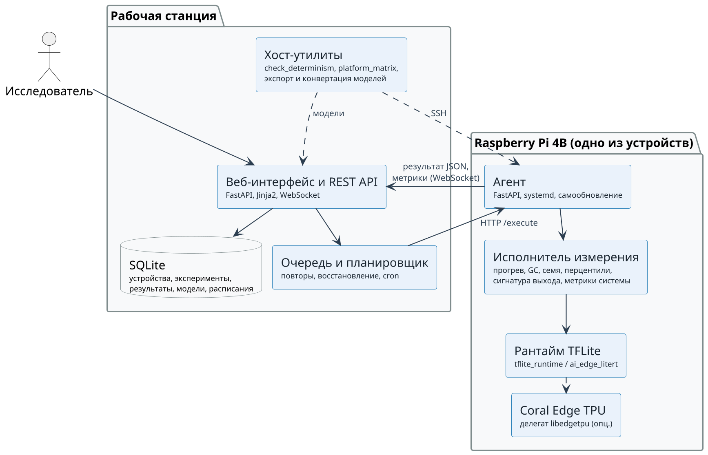
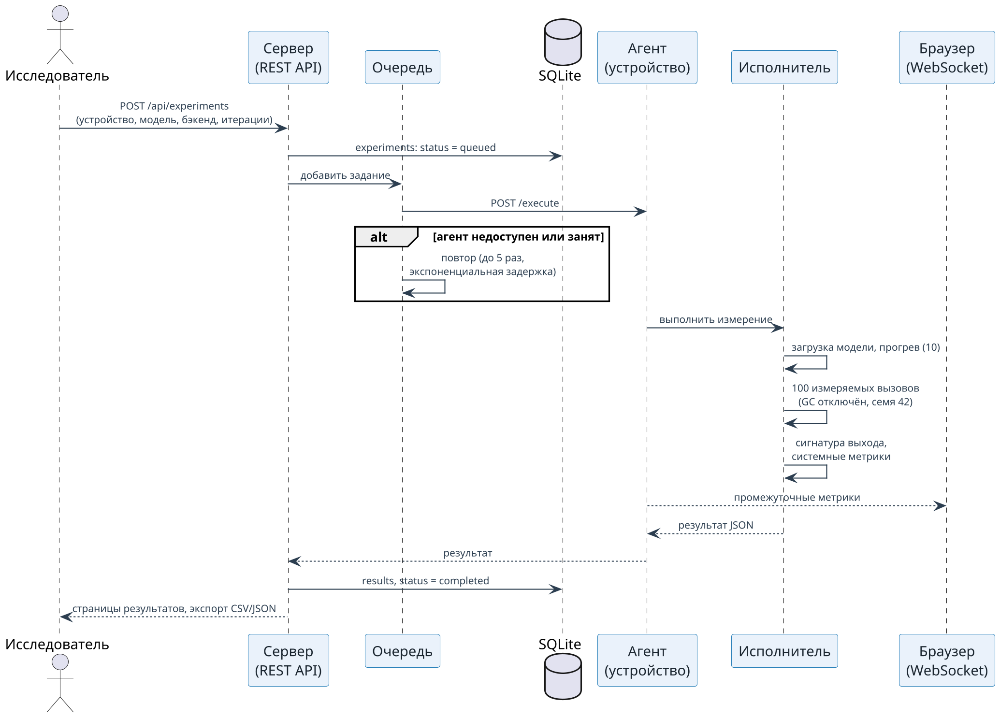

УДК 004.032.26:004.4

**Н. С. Колесников, А. Г. Кравец**

# EDGE-BENCH: ПЛАТФОРМА АППАРАТНОГО БЕНЧМАРКИНГА НЕЙРОСЕТЕВЫХ МОДЕЛЕЙ НА ГРАНИЧНЫХ УСТРОЙСТВАХ С КОНТРОЛЕМ ЭКВИВАЛЕНТНОСТИ ВЫЧИСЛЕНИЙ

<!-- BEGIN ABSTRACT_RU -->
*Выбор нейросетевой модели для граничного устройства опирается на измерения латентности и пропускной способности на целевом оборудовании, однако распространённые инструменты измеряют только время вызова интерпретатора и не проверяют, что модель на разных устройствах вычисляет один и тот же результат; провенанс окружения (версии рантайма, частота и температура процессора) при этом теряется. Цель работы — разработать открытую программную платформу распределённого бенчмаркинга моделей TensorFlow Lite на граничных устройствах, которая фиксирует условия измерения и контролирует эквивалентность вычислений между платформами. Задачи: спроектировать клиент-серверную архитектуру с очередью экспериментов и агентами на устройствах; реализовать протокол измерения с прогревом, отключением сборщика мусора и детерминированным входом; ввести сигнатуру выходного тензора и проверку детерминизма модели; провести измерения на реальном оборудовании. Методы: асинхронный сервер FastAPI с хранилищем SQLite, агенты на Raspberry Pi под управлением systemd, статистика латентности по перцентилям, сравнение выходов по индексам top-k и контрольной сумме деквантованных значений. Результаты: для MobileNetV2 INT8 на Raspberry Pi 4B медиана латентности составила 5,07 мс на ускорителе Coral Edge TPU при коэффициенте вариации 0,48 % и 33,24 мс на CPU, ускорение 6,56×; проверка эквивалентности выявила модель, которая под именем INT8 исполнялась в float32, давала разный результат при каждом создании интерпретатора и совпадала с эталоном лишь на уровне косинуса 0,50, тогда как её латентность два месяца числилась в реестре результатов. Новизна состоит в объединении оркестрации измерений, фиксации провенанса и контроля эквивалентности выходов в одной платформе; практическая значимость — открытая реализация с 80 тестами и непрерывной интеграцией, не требующей оборудования.*
<!-- END ABSTRACT_RU -->

*Граничные вычисления; бенчмаркинг; нейронные сети; квантование INT8; TensorFlow Lite; Edge TPU; Raspberry Pi; воспроизводимость; провенанс измерений; детерминизм вывода.*

**N. S. Kolesnikov, A. G. Kravets**

# EDGE-BENCH: A PLATFORM FOR HARDWARE BENCHMARKING OF NEURAL NETWORK MODELS ON EDGE DEVICES WITH COMPUTATIONAL EQUIVALENCE CONTROL

<!-- BEGIN ABSTRACT_EN -->
*Selecting a neural network model for an edge device relies on latency and throughput measured on the target hardware, yet common tools time only the interpreter call and never check that the model computes the same answer on different devices; the environment provenance (runtime versions, CPU frequency, temperature) is lost as well. This work develops an open platform for distributed benchmarking of TensorFlow Lite models on edge devices that records measurement conditions and controls computational equivalence across platforms. Objectives: design a client-server architecture with an experiment queue and on-device agents; implement a measurement protocol with warm-up, garbage collector suspension and a deterministic input; introduce an output-tensor signature and a model determinism check; measure on real hardware. Methods: an asynchronous FastAPI server with SQLite storage, systemd-managed agents on Raspberry Pi, percentile latency statistics, output comparison by top-k indices and a checksum of dequantized values. Results: for MobileNetV2 INT8 on a Raspberry Pi 4B the median latency was 5.07 ms on the Coral Edge TPU (coefficient of variation 0.48 %) and 33.24 ms on the CPU, a 6.56× speed-up; the equivalence check exposed a model that ran in float32 under an INT8 name, returned a different result on every interpreter construction and matched the reference only at cosine 0.50, while its latency had been listed in the results registry for two months. The novelty lies in combining measurement orchestration, provenance recording and output equivalence control in one platform; the practical value is an open implementation with 80 tests and hardware-free continuous integration.*
<!-- END ABSTRACT_EN -->

*Edge computing; benchmarking; neural networks; INT8 quantization; TensorFlow Lite; Edge TPU; Raspberry Pi; reproducibility; measurement provenance; inference determinism.*

## Введение

Перенос вывода нейронных сетей с облачных серверов на граничные устройства — одноплатные компьютеры, микроконтроллеры и специализированные ускорители — стал самостоятельным направлением исследований [[shi2016]], [[zhou2019]]. Для таких устройств решение о выборе архитектуры модели, схемы квантования и рантайма принимается по измерениям на целевом оборудовании: латентности одного вывода, пропускной способности, резидентной памяти и теплового режима. Эталонные наборы MLPerf Inference [[reddi2020]] и MLPerf Tiny [[banbury2021]] задают протоколы для серверных и микроконтроллерных систем, AI Benchmark [[ignatov2019]] покрывает смартфоны, а работы [[bianco2018]], [[hadidi2019]], [[baller2021]] сравнивают коммерческие граничные платформы на фиксированном наборе моделей. Общий недостаток этих инструментов для исследовательской практики состоит в том, что они либо поставляются как закрытые наборы с собственными моделями, либо представляют собой одноразовые сценарии измерения на одном устройстве без сохранения условий эксперимента.

Между тем результат бенчмарка на граничном устройстве определяется не только моделью. На него влияют версия рантайма и способ его установки, число потоков, режим управления частотой процессора, тепловое состояние платы и даже распределение входных данных, от которого зависят пути исполнения квантованных ядер. Если эти условия не зафиксированы вместе с числом, число невоспроизводимо; проблема воспроизводимости в машинном обучении хорошо документирована [[gundersen2018]], [[pineau2020]], но применительно к аппаратным замерам на граничных устройствах она обычно сводится к требованию «указать оборудование».

Есть и вторая, менее очевидная проблема. Бенчмарк, который измеряет только время вызова интерпретатора, с одинаковой готовностью сообщит отличную латентность и для корректной модели, и для модели, вычисляющей бессмыслицу: неверно скомпилированная для ускорителя сеть, сломанный делегат или модель, квантованная не той схемой, исполняются быстро. Сравнение двух устройств по латентности осмысленно лишь тогда, когда установлено, что на одном и том же входе они вычислили одно и то же; ни один из перечисленных выше инструментов такой проверки в процедуру измерения не включает.

В настоящей работе представлена edge-bench — открытая программная платформа, которая объединяет три функции: распределённый запуск измерений на парке устройств через лёгкие агенты, фиксацию провенанса каждого результата (модель, параметры, версии рантайма, частотно-тепловые ряды) и контроль эквивалентности вычислений между платформами по сигнатуре выходного тензора. Отличие от существующих решений состоит именно в третьей функции и в её сочетании с первыми двумя: сравнительная таблица латентностей строится только для тех прогонов, для которых подтверждено совпадение вычисленного ответа. Работоспособность подхода показана на реальном оборудовании: измерения MobileNetV2 INT8 на Raspberry Pi 4B с ускорителем Coral Edge TPU и без него, а также обнаружение дефектной модели, латентность которой ранее считалась установленной.

## 1. Постановка задачи

**Объект исследования** — процесс измерения производительности нейросетевых моделей на граничных устройствах. **Предмет исследования** — программная архитектура и протокол измерения, обеспечивающие воспроизводимость и сопоставимость результатов между устройствами. **Цель работы** — разработать платформу распределённого бенчмаркинга моделей TensorFlow Lite [[abadi2015]], которая фиксирует условия измерения и проверяет эквивалентность вычислений между платформами, и подтвердить её работоспособность измерениями на реальном оборудовании.

**Задачи исследования:** 1) спроектировать клиент-серверную архитектуру, в которой сервер управляет очередью экспериментов и хранит результаты, а агенты на устройствах выполняют измерения; 2) реализовать протокол измерения латентности, устойчивый к известным источникам искажений (прогрев, сборщик мусора, изменение частоты процессора, распределение входа); 3) определить сигнатуру выходного тензора и процедуру проверки детерминизма модели, пригодные для сравнения устройств с разными рантаймами и ускорителями; 4) обеспечить полноту провенанса результата и качество программной реализации (тесты, непрерывная интеграция, контейнеризация); 5) провести измерения на Raspberry Pi 4B с ускорителем Edge TPU и без него и оценить, что даёт проверка эквивалентности на практике.

**Требования к платформе** сформулированы исходя из условий исследовательской лаборатории. Устройства подключены к локальной сети без выхода в Интернет; их число невелико (единицы), но состав меняется; на устройствах нет графических процессоров и CUDA. Сервер должен запускаться без конфигурации и работать на рабочей станции или в контейнере. Измерение должно быть воспроизводимо по одному файлу результата: в нём обязаны быть все параметры, необходимые для повторения прогона, и все признаки, по которым результат может быть отвергнут (троттлинг, падение частоты, отсутствие ускорителя). Наконец, результат должен содержать компактное свидетельство того, *что* вычислила модель, а не только *как быстро*.

**Гипотеза.** Включение проверки эквивалентности выходов в процедуру измерения позволяет обнаруживать дефектные модели и сборки, которые по латентности неотличимы от корректных, и тем самым предотвращает попадание невалидных чисел в публикуемые сравнения. Гипотеза проверяется в разделе 3 на корпусе моделей проекта.

## 2. Методика исследования: архитектура платформы и протокол измерения

### 2.1. Стратегия и этапы

Платформа построена экспериментальным путём в четыре этапа: 1) сервер и агент с базовым измерением латентности; 2) расширение протокола измерения и провенанса результата по итогам первых прогонов на Raspberry Pi; 3) введение сигнатуры выхода и проверки детерминизма после обнаружения расхождений между устройствами; 4) сравнительная матрица платформ и проверка на корпусе моделей. Каждый этап завершался измерением на реальном оборудовании; результаты измерений хранятся в репозитории как исследовательские артефакты вместе с исходным кодом.

Архитектурные принципы: модульность (сервер, агент и утилиты — независимые пакеты с явными интерфейсами HTTP); минимальные зависимости на устройстве (агент использует только рантайм TFLite, `numpy` и `psutil`); единственная каноническая реализация измерения, которую используют и агент, и автономные сценарии, — расхождение копий измерительного кода является типичной причиной несовпадения «одинаковых» прогонов; отсутствие обязательной конфигурации.

### 2.2. Компоненты системы и их взаимодействие

Платформа состоит из трёх частей (рис. 1). **Сервер** — асинхронное приложение на FastAPI, которое ведёт реестр устройств, принимает загруженные модели, управляет очередью экспериментов, хранит результаты в SQLite и отдаёт веб-интерфейс. **Агент** — лёгкий HTTP-сервис на устройстве, который по запросу сервера загружает модель, выполняет измерение и возвращает результат; агент устанавливается одной командой через эндпоинт `/install` сервера, который отдаёт сценарий установки, создаёт виртуальное окружение, регистрирует службу systemd и устройство в реестре. **Хост-утилиты** — сценарии для рабочей станции: проверка детерминизма моделей, сравнительная матрица платформ, конвертация и экспорт моделей.

{width=13cm}

**Рис. 1.** Компонентная архитектура платформы edge-bench. Сплошные стрелки — запросы HTTP; пунктирные — потоки данных.

Взаимодействие компонентов при выполнении эксперимента показано на рис. 2. Пользователь создаёт эксперимент через веб-интерфейс или REST-запрос, указывая устройство, модель, бэкенд (`cpu` или `edgetpu`), число потоков, число прогревочных и измеряемых итераций. Сервер ставит эксперимент в очередь; обработчик очереди последовательно отправляет задания агентам, повторяя попытку при недоступности или занятости агента (до пяти попыток с экспоненциальной задержкой) и восстанавливая очередь из базы данных после перезапуска сервера. Агент выполняет измерение и в ходе работы передаёт серверу промежуточные метрики, которые транслируются в браузер по WebSocket. Результат сохраняется в таблице результатов и становится доступен на страницах сравнения, а также для экспорта в CSV и JSON. Планировщик на основе APScheduler позволяет задавать регулярные прогоны по cron-выражению; расписания хранятся в базе и переживают перезапуск.

{width=13cm}

**Рис. 2.** Последовательность выполнения эксперимента: от постановки в очередь до сохранения результата.

Состав реализации приведён в таблице 1. Веб-интерфейс отрисовывается на сервере шаблонами Jinja2 без сборки фронтенда; библиотека графиков включена в поставку, поэтому интерфейс работает в изолированной сети лаборатории. Все настройки задаются переменными окружения с рабочими значениями по умолчанию; единственный секрет — общий ключ агента, который включает аутентификацию запросов к API.

**Таблица 1.** Состав платформы edge-bench.

| Компонент | Технологии | Объём, строк Python | Назначение |
|---|---|---:|---|
| Сервер (`server/`) | FastAPI, uvicorn, aiosqlite, APScheduler, Jinja2 | 5094 | 86 маршрутов API и интерфейса, очередь, планировщик, WebSocket, 9 таблиц SQLite |
| Агент (`agent/`) | FastAPI, рантайм TFLite, numpy, psutil | 3113 | Исполнение измерений, сбор системных метрик, локальный кэш результатов, самообновление |
| Хост-утилиты (`scripts/`) | numpy, SSH | 3379 | Проверка детерминизма, матрица платформ, экспорт и конвертация моделей |
| Тесты (`tests/`) | pytest | 1863 | 80 тестов, из них 11 аппаратных — помечены отдельно и пропускаются без рантайма |

### 2.3. Протокол измерения латентности

Измерение выполняет единственный модуль агента, который используется и в распределённом, и в автономном режиме. Протокол включает следующие правила.

1. *Прогрев.* Заданное число итераций (по умолчанию 10) выполняется до начала измерения и исключается из статистики; время первой итерации фиксируется отдельно как часть холодного старта.
2. *Сборщик мусора.* На время каждого измеряемого вызова интерпретатора сборщик мусора Python отключается и восстанавливается сразу после вызова, так что он не искажает ни латентность, ни измерение памяти.
3. *Детерминированный вход.* Входной тензор генерируется из фиксированного семени (по умолчанию 42) с учётом типа данных модели: для целочисленного входа — равномерно по всему диапазону типа, для вещественного — в диапазоне [0, 1]. Одно и то же семя на всех устройствах даёт побайтово идентичный вход, что необходимо для сравнения выходов; вместе с тем квантованные ядра могут выбирать разные пути исполнения в зависимости от распределения входа, поэтому семя записывается в результат.
4. *Статистика.* По измеряемым итерациям вычисляются среднее, стандартное отклонение, минимум, максимум, перцентили p50, p75, p90, p95, p99, межквартильный размах, коэффициент вариации и число выбросов; все отдельные значения сохраняются. Пропускная способность приводится в двух определениях — по среднему и по медиане, поскольку при тяжёлом хвосте распределения они расходятся.
5. *Системные метрики.* Параллельный поток с шагом не более 100 мс регистрирует загрузку процессора, резидентную память процесса измерения (а не всей системы), температуру и текущую частоту процессора. По этим рядам формируются предупреждения о тепловом троттлинге и падении частоты; результат с предупреждением помечается и не должен цитироваться.
6. *Режим частоты.* Для публикуемых чисел регулятор частоты процессора переводится в режим `performance`: в режиме `powersave` снижение частоты в простое неотличимо от троттлинга, и прогон получает предупреждение.

Холодный старт измеряется отдельно как сумма времени загрузки модели и времени первого вывода: для ускорителя Edge TPU загрузка включает передачу модели на устройство и занимает секунды, тогда как установившаяся латентность составляет миллисекунды, и смешивать эти величины нельзя.

### 2.4. Провенанс результата

Файл результата должен позволять повторить прогон и отвергнуть его при нарушении условий. Поэтому агент записывает поля, перечисленные в таблице 2. Отдельно отметим поле источника рантайма: на Raspberry Pi OS используется классический пакет `tflite_runtime`, на рабочих станциях с современным CPython — его преемник `ai_edge_litert`, а при отсутствии обоих — полный TensorFlow. Порядок разрешения выбирает облегчённые рантаймы первыми, чтобы измерения на устройстве не зависели от наличия полного пакета; фактически выбранный источник и его версия попадают в результат, поскольку они влияют на латентность.

**Таблица 2.** Поля записи результата, обеспечивающие воспроизводимость.

| Группа | Поля |
|---|---|
| Модель | имя, префикс SHA-256, размер, схема квантования, форма и тип входа и выхода |
| Параметры | запрошенный и фактический бэкенд, обнаружен ли ускоритель, число потоков, число прогревочных и измеряемых итераций, семя входа |
| Латентность | среднее, отклонение, минимум, максимум, перцентили, все отдельные значения |
| Пропускная способность | по среднему и по медиане |
| Холодный старт | время загрузки модели, время первого вывода |
| Система | ряды загрузки CPU, резидентной памяти, температуры и частоты; предупреждения |
| Устройство и рантайм | модель платы, ядро, архитектура, версии Python, numpy, источника TFLite, библиотеки Edge TPU, регулятор частоты |
| Сигнатура выхода | индексы top-k, контрольная сумма, сумма, среднее и норма деквантованного тензора |

Измеренные прогоны хранятся в репозитории в каталоге результатов вместе с нормализованной сводкой (сценарий, машина, ревизия git, ключевые метрики) и являются входными данными для реестра результатов диссертации; выход коротких проверочных прогонов в тот же каталог не попадает и цитироваться не может.

### 2.5. Сигнатура выхода и проверка детерминизма

Полный выходной тензор хранить нецелесообразно, но компактной сигнатуры достаточно, чтобы обнаружить неверно скомпилированную модель или сломанный делегат. После измерения агент считывает выходной тензор, снимает аффинное квантование по масштабу и нулевой точке тензора, чтобы INT8-модель для CPU и её сборка для Edge TPU сравнивались в одних единицах, и вычисляет: индексы $k$ наибольших значений ($k = 5$) — вердикт классификатора; контрольную сумму SHA-256 деквантованных значений — критерий точного совпадения; сумму, среднее и евклидову норму — для допускового сравнения вещественных путей.

Сравнение двух сигнатур даёт один из вердиктов таблицы 3. Утилита сравнительной матрицы запускает одну модель на нескольких целях вида `имя=хост:бэкенд[@модель]`, где пустой хост означает текущую машину, а переопределение модели требуется для Edge TPU, которому нужна собственная скомпилированная сборка; сравнение сборки для ускорителя с исходной сборкой для CPU и есть основной случай применения. Утилита завершается с ненулевым кодом возврата при расхождении top-1, поэтому её можно использовать как проверку перед публикацией результатов или выпуском версии.

**Таблица 3.** Вердикты сравнения сигнатур выхода.

| Вердикт | Условие |
|---|---|
| Точное совпадение | совпадают контрольные суммы деквантованных тензоров |
| Совпадение top-k при разной арифметике | совпадают индексы top-k, контрольные суммы различаются (ожидаемо для разных ядер и ускорителей) |
| Совпадение top-1 при разном ранжировании | совпадает индекс top-1, порядок остальных индексов различается |
| Расхождение | индекс top-1 различается; сравнение латентностей недопустимо |

Проверка детерминизма отвечает на вопрос, который сравнение устройств поставить не может: возвращает ли модель одно и то же на одном и том же входе. Одинаковый тензор подаётся нескольким заново созданным интерпретаторам (по умолчанию шести) и повторно одному интерпретатору; сравнение обоих рядов различает две причины расхождений. Если различаются заново созданные интерпретаторы, а повторные вызовы одного совпадают, состояние, устанавливаемое при построении или выделении памяти, различается между экземплярами и модель зависит от чего-то, не заданного входом. Если различаются и повторные вызовы, недетерминизм лежит внутри исполнения (потоки, планирование). Дополнительно подсчитывается доля вещественных тензоров в графе: модель с именем INT8, у которой первая операция — деквантование, а значительная часть тензоров вещественна, выполняет не полноцелочисленный вывод, и её латентность не характеризует INT8-путь. Проверка завершается ненулевым кодом при любом недетерминизме и применяется ко всему корпусу моделей проекта одной командой.

### 2.6. Качество реализации и непрерывная интеграция

Проверки качества разделены на два независимых уровня. Уровень 1 — линтер, проверка форматирования, статическая типизация пакета сервера, тесты с покрытием и проверка импортируемости приложения; он не требует ни графического процессора, ни ускорителя, ни весов моделей и выполняется на любом облачном раннере. Уровень 2 — аппаратная валидация: тесты, помеченные как аппаратные, и короткий проверочный прогон на реальном рантайме; они выполняются на самостоятельном раннере и пропускаются, а не имитируются, при отсутствии рантайма или модели. Все проверки оформлены как цели `make`, поэтому описание конвейера не зависит от провайдера. Приложение поставляется многоэтапным Docker-образом с зависимостями из файла блокировки, запускается от непривилегированного пользователя и проверяется по эндпоинту состояния; отдельный образ позволяет выполнить измерение на хосте без пригодного Python.

## 3. Результаты и их обсуждение

### 3.1. Стенд и модели

Измерения выполнены на стенде, описанном в таблице 4. Основная модель — MobileNetV2 [[sandler2018]] с входом 224×224, квантованная до INT8 методом постобучающего квантования [[jacob2018]], [[krishnamoorthi2018]], [[nagel2021]] на калибровочной выборке из 512 изображений при семени 42; это конфигурация C6 программного комплекса диагностики заболеваний растений, для которой платформа и создавалась. Дополнительно использована модель MobileNetV1 INT8 [[howard2017]] для проверки сравнения трёх платформ. Для ускорителя Coral Edge TPU [[cass2019]], [[coral2019]] модель компилируется отдельно; сборка считается полностью отображённой, если все операции графа исполняются на ускорителе.

**Таблица 4.** Стенд измерений.

| Параметр | Граничное устройство | Рабочая станция |
|---|---|---|
| Платформа | Raspberry Pi 4 Model B Rev 1.5 [[raspberrypi]], 8 ГБ ОЗУ, ARM Cortex-A72, 1800 МГц | x86_64 |
| Ускоритель | Coral USB Accelerator (Edge TPU), USB 3.0 | — |
| ОС, ядро | Raspberry Pi OS 64-bit, Linux 6.12.93, glibc 2.36 | Linux, glibc 2.42 |
| Python, рантайм | 3.11.2, tflite_runtime 2.14.0 | ai_edge_litert 2.1.6 |
| Протокол | 10 прогревочных, 100 измеряемых итераций, семя 42, 4 потока, регулятор `performance` | то же, 50 итераций в матрице платформ |

### 3.2. Измерения на реальном оборудовании

Результаты для MobileNetV2 INT8 на Raspberry Pi 4B приведены в таблице 5; источник — файлы результатов прогона 14 августа 2026 г.

**Таблица 5.** MobileNetV2 INT8 на Raspberry Pi 4B: CPU и Edge TPU, 100 измеряемых итераций.

| Показатель | CPU (4 потока) | Edge TPU |
|---|---:|---:|
| Латентность, среднее ± отклонение, мс | 33,40 ± 0,98 | 5,08 ± 0,02 |
| Медиана p50, мс | 33,24 | 5,07 |
| p95 / p99, мс | 34,41 / 35,23 | 5,12 / 5,15 |
| Коэффициент вариации, % | 2,94 | 0,48 |
| Выбросов из 100 | 1 | 1 |
| Пропускная способность, вывод/с | 29,9 | 197,0 |
| Загрузка модели, мс | 2,9 | 2647,5 |
| Первый вывод, мс | 37,4 | 13,5 |
| Резидентная память процесса, МБ | 47,6 | 47,7 |
| Загрузка CPU, % (среднее) | 87,9 | 5,5 |
| Температура, начало → конец, °C | 39,4 → 43,8 | 38,0 → 39,4 |
| Предупреждения о троттлинге | нет | нет |

Ускоритель сокращает медиану латентности в 6,56 раза и практически устраняет разброс: коэффициент вариации 0,48 % против 2,94 % на CPU, размах между минимумом и максимумом 0,15 мс против 9,3 мс. Загрузка процессора при этом падает с 88 % до 5 %, так как арифметика выполняется на ускорителе, а на процессоре остаются подготовка входа и передача данных по USB. Цена ускорения — холодный старт: загрузка модели на Edge TPU занимает 2,65 с против 2,9 мс на CPU. Для сценария, в котором устройство просыпается, обрабатывает один кадр и засыпает, эта величина определяет время отклика, и платформа сообщает её отдельно от установившейся латентности именно поэтому. Резидентная память процесса в обоих случаях около 48 МБ и определяется рантаймом, а не моделью объёмом 2,6–2,8 МБ.

Сравнение трёх платформ по матрице показано в таблице 6 на модели MobileNetV1 INT8. Рабочая станция быстрее Raspberry Pi на CPU в 36 раз, однако ускоритель Edge TPU на Raspberry Pi уступает рабочей станции лишь в 5 раз. Существенно, что таблица построена только после подтверждения эквивалентности: на всех трёх целях совпали индексы top-5, контрольные суммы различаются, а относительное расхождение евклидовой нормы выхода составляет 0,17 %. Различие контрольных сумм при совпадении ранжирования ожидаемо — разные ядра и ускоритель реализуют целочисленную арифметику с разным порядком округления, — и вердикт «совпадение top-k при разной арифметике» фиксирует именно это.

**Таблица 6.** Матрица платформ для MobileNetV1 INT8, 50 измеряемых итераций, эталон — рабочая станция.

| Цель | Рантайм | p50, мс | p95, мс | Вывод/с | RSS, МБ | Загрузка модели, мс | Вердикт | Δ нормы, % |
|---|---|---:|---:|---:|---:|---:|---|---:|
| x86_64, CPU | ai_edge_litert 2.1.6 | 0,91 | 1,22 | 1011 | 61,8 | 4,6 | эталон | — |
| RPi 4B, CPU | tflite_runtime 2.14.0 | 33,02 | 35,98 | 29,8 | 51,2 | 1,7 | совпадение top-5 | 0,17 |
| RPi 4B, Edge TPU | tflite_runtime 2.14.0 | 4,70 | 4,78 | 211,9 | 51,5 | 2677,0 | совпадение top-5 | 0,18 |

### 3.3. Обнаружение дефектной модели

Практическую ценность контроля эквивалентности показал корпус моделей самого проекта. Модель конфигурации C6 с именем, содержащим `int8`, два месяца числилась в реестре результатов с латентностью, измеренной 6 июня 2026 г. Проверка детерминизма, введённая на третьем этапе разработки, показала, что модель возвращает разный результат при каждом заново созданном интерпретаторе, причём это воспроизвелось на двух рантаймах и двух архитектурах — `ai_edge_litert` 2.1.6 на x86_64 и `tflite_runtime` 2.14 на aarch64. Разбор графа объяснил причину: первой операцией было деквантование, а 139 из 234 тензоров были вещественными, то есть модель несла квантование только весов, а не полноцелочисленную схему, которую используют остальные модели корпуса. Косинусное сходство её выхода с эталоном float32 составило 0,50. Латентность этой модели была измерена корректно — но характеризовала не INT8-вывод, и число было отозвано из реестра.

Матрица платформ, выполненная 13 августа 2026 г. с дефектной сборкой в качестве эталона, показывает, как выглядит такой случай в сравнении устройств (таблица 7). Ни одна цель не совпала с эталоном даже по top-1; относительное расхождение нормы выхода составило 24–49 %. При этом латентность дефектной сборки на Raspberry Pi была не только выше, но и нестабильнее: стандартное отклонение 31,7 мс против 1,6 мс у исправленной сборки при том же протоколе. Без сигнатуры выхода этот прогон выглядел бы как обычное сравнение двух версий модели.

**Таблица 7.** Матрица платформ для дефектной (старой) и исправленной (новой) сборок C6, 50 итераций, эталон — старая сборка на x86_64.

| Цель | p50, мс | Среднее ± отклонение, мс | Вывод/с | Вердикт относительно эталона | Δ нормы, % |
|---|---:|---:|---:|---|---:|
| x86_64, старая сборка | 7,78 | 7,78 ± 0,46 | 128,6 | эталон | — |
| x86_64, новая сборка | 4,07 | 4,11 ± 0,21 | 243,2 | расхождение | 24,9 |
| RPi 4B, старая сборка | 122,61 | 137,90 ± 31,75 | 7,3 | расхождение | 49,2 |
| RPi 4B, новая сборка | 55,67 | 55,97 ± 1,60 | 17,9 | расхождение | 24,0 |

После исправления получены три сборки из одного источника и одной калибровки (таблица 8). Сборка через ONNX и инструмент ai-edge-quantizer точна (косинус к float32 0,9913), но не компилируется для Edge TPU. Сборка через клон архитектуры в Keras, воспроизводящий эталон torchvision с косинусом 0,99999988, даёт ту же точность и латентность 33,24 мс на CPU, но компилятор Edge TPU версии 16.0 отображает на ускоритель лишь 4 из 68 операций, сообщая о неконстантных параметрах для 48 свёрток, веса которых являются обычными константами INT8. Та же сеть, квантованная штатным конвертером TFLite, отображается полностью (68 из 68 операций) ценой снижения косинуса до 0,9692. Поскольку версия 16.0 является последним публичным выпуском компилятора, точность и полное отображение на ускоритель в настоящее время несовместимы, и выбор сборки определяется задачей; платформа делает это ограничение видимым, поскольку число отображённых операций и косинус к эталону входят в нормализованную сводку результата.

**Таблица 8.** Сборки MobileNetV2 INT8 из одного источника и одной калибровки.

| Сборка | Маршрут | Косинус к float32 | RPi 4B CPU, p50, мс | Операций на Edge TPU |
|---|---|---:|---:|---|
| `c6_mobilenet_v2_int8` | ONNX → onnx2tf → ai-edge-quantizer | 0,9913 | 55,99 | не компилируется |
| `c6_mobilenet_v2_int8_accurate` | torchvision → клон Keras → ai-edge-quantizer | 0,9912 | 33,24 | 4 из 68 |
| `c6_mobilenet_v2_int8_tpu` | torchvision → клон Keras → TFLiteConverter | 0,9692 | 33,24 | 68 из 68 |

Различие латентности двух точных сборок — 55,99 против 33,24 мс при одинаковой архитектуре и разрядности — показывает, что маршрут конвертации влияет на время вывода в 1,7 раза, и это ещё один аргумент за фиксацию хэша модели и маршрута её получения в провенансе результата. Проверка детерминизма текущего корпуса моделей (18 файлов, из них 9 сборок для Edge TPU пропущены на рабочей станции) завершилась с нулевым кодом возврата: каждая проверенная модель даёт один и тот же выход на шести заново созданных интерпретаторах и на шести повторных вызовах. Доля вещественных тензоров равна нулю для сборок маршрута Keras (0 из 175) и для моделей MobileNetV1 и ResNet-50, но не для сборки маршрута ONNX: у `c6_mobilenet_v2_int8` вещественны 20 из 271 тензоров — это пути «деквантование → дополнение нулями → повторное квантование», которые конвертер onnx2tf порождает вокруг пяти свёрток с дополнением. Эта сборка детерминирована, однако не является полноцелочисленной в строгом смысле, и её латентность 55,99 мс следует относить именно к такому графу; проверка делает это различие видимым до публикации числа.

### 3.4. Сравнение с существующими инструментами

Сопоставление с известными бенчмарками приведено в таблице 9. MLPerf Inference [[reddi2020]] и MLPerf Tiny [[banbury2021]] задают строгие протоколы и контролируют качество модели через целевую точность на эталонном наборе данных, но ориентированы на сопоставление систем поставщиков на фиксированном наборе задач и не предназначены для измерения произвольной исследовательской модели на парке устройств лаборатории. AI Benchmark [[ignatov2019]] — приложение для смартфонов с закрытой процедурой. Работы [[hadidi2019]] и [[baller2021]] содержат ценные измерения коммерческих граничных платформ, но представляют собой исследования, а не переиспользуемые инструменты. Анализ DAWNBench [[coleman2019]] показал, что даже при фиксированном протоколе результаты бенчмарков чувствительны к деталям постановки, что подтверждает необходимость фиксации провенанса. Ни один из перечисленных инструментов не включает в процедуру сравнение выходов между устройствами на одном входе и проверку детерминизма модели.

**Таблица 9.** Функциональное сравнение с существующими инструментами бенчмаркинга.

| Инструмент | Целевые системы | Произвольная модель | Распределённый запуск на парке устройств | Провенанс окружения в результате | Сравнение выходов между устройствами | Открытый код |
|---|---|:---:|:---:|:---:|:---:|:---:|
| MLPerf Inference [[reddi2020]] | серверы, рабочие станции, edge | нет | нет | частично | нет | да |
| MLPerf Tiny [[banbury2021]] | микроконтроллеры | нет | нет | частично | нет | да |
| AI Benchmark [[ignatov2019]] | смартфоны | нет | нет | нет | нет | нет |
| DeepEdgeBench [[baller2021]] | одноплатные компьютеры, ускорители | да | нет | частично | нет | да |
| edge-bench (данная работа) | одноплатные компьютеры, Edge TPU, x86 | да | да | да | да | да |

Оценка «частично» означает, что инструмент публикует описание системы, но не сохраняет частотно-тепловые ряды и версии рантайма в каждом файле результата. Оценки основаны на публикациях и открытой документации инструментов.

### 3.5. Ограничения

Границы полученных результатов формулируем явно. Платформа поддерживает только рантайм TensorFlow Lite и его преемник; ONNX Runtime, TensorRT и графические процессоры не поддерживаются. Потребление энергии не измеряется. Все аппаратные измерения выполнены на одном экземпляре Raspberry Pi 4B и одном ускорителе; перенос на другие ревизии и системы охлаждения не проверялся. Синтетический вход из равномерного шума покрывает весь диапазон INT8 и далёк от распределения естественных изображений: для некоторых квантованных классификаторов выход насыщается и не зависит от семени, так что латентность и память остаются валидными (стоимость свёртки не зависит от данных), но сигнатура выхода для таких моделей является слабым свидетельством. Канал WebSocket не аутентифицирован, а общий секрет агента доступен в коде страницы, поэтому платформа рассчитана на изолированную сеть лаборатории. Сравнение с другими инструментами в таблице 9 выполнено по их описаниям, а не по запуску на общем стенде.

## Заключение

В работе представлена открытая платформа edge-bench для распределённого бенчмаркинга нейросетевых моделей на граничных устройствах. Поставленные задачи решены: реализована клиент-серверная архитектура с очередью экспериментов, повторными попытками и агентами, устанавливаемыми одной командой; протокол измерения учитывает прогрев, сборщик мусора, режим частоты процессора и распределение входа; результат содержит полный провенанс, включая частотно-тепловые ряды и версии рантайма; введены сигнатура выходного тензора и проверка детерминизма, а сравнительная матрица платформ отказывает в сравнении при расхождении вычисленного ответа.

Измерения на Raspberry Pi 4B показали для MobileNetV2 INT8 медиану латентности 5,07 мс на Edge TPU при коэффициенте вариации 0,48 % против 33,24 мс на CPU — ускорение 6,56× при холодном старте 2,65 с против 40 мс. Гипотеза о полезности контроля эквивалентности подтверждена: проверка обнаружила модель, которая под именем INT8 исполнялась в float32, была недетерминирована и совпадала с эталоном на уровне косинуса 0,50, тогда как её латентность два месяца считалась установленной; она же показала, что маршрут конвертации меняет латентность корректных сборок в 1,7 раза, а точность и полное отображение на Edge TPU в текущей версии компилятора несовместимы.

**Научная новизна** состоит в включении контроля эквивалентности вычислений — сигнатуры выхода, вердиктов сравнения и проверки детерминизма — в процедуру аппаратного бенчмаркинга и в его сочетании с оркестрацией измерений на парке устройств и фиксацией провенанса каждого результата. **Практическая значимость** — открытая реализация (лицензия MIT) с 80 тестами и двухуровневой непрерывной интеграцией, первый уровень которой не требует оборудования; платформа применяется как измерительная инфраструктура в исследованиях по граничной диагностике заболеваний растений и может использоваться для любых моделей TensorFlow Lite.

Направления дальнейшей работы: поддержка NVIDIA Jetson и рантайма ONNX; измерение энергопотребления; адаптивное число итераций с остановкой при стабилизации коэффициента вариации; аутентификация канала WebSocket. Исходный код доступен по адресу <https://github.com/ml-nskolesnikov/edge-bench>.

<!-- REFERENCES -->

**Колесников Никита Сергеевич** — Волгоградский государственный технический университет; e-mail: kn15@bk.ru; 400005, Россия, г. Волгоград, проспект им. В. И. Ленина, д. 28; тел.: +79053959391; аспирант кафедры систем автоматизированного проектирования и поискового конструирования.

**Кравец Алла Григорьевна** — Волгоградский государственный технический университет; e-mail: AllaGKravets@yandex.ru; 400005, Россия, г. Волгоград, проспект им. В. И. Ленина, д. 28; тел.: [уточнить]; д-р техн. наук, профессор, профессор кафедры систем автоматизированного проектирования и поискового конструирования.

**Kolesnikov Nikita Sergeevich** — Volgograd State Technical University; e-mail: kn15@bk.ru; 28 Lenina pr., Volgograd, 400005, Russia; phone: +79053959391; postgraduate student, Department of Computer-Aided Design and Search Engineering.

**Kravets Alla Grigorevna** — Volgograd State Technical University; e-mail: AllaGKravets@yandex.ru; 28 Lenina pr., Volgograd, 400005, Russia; phone: [to be specified]; Dr. Sci. (Eng.), Professor, Professor of the Department of Computer-Aided Design and Search Engineering.
